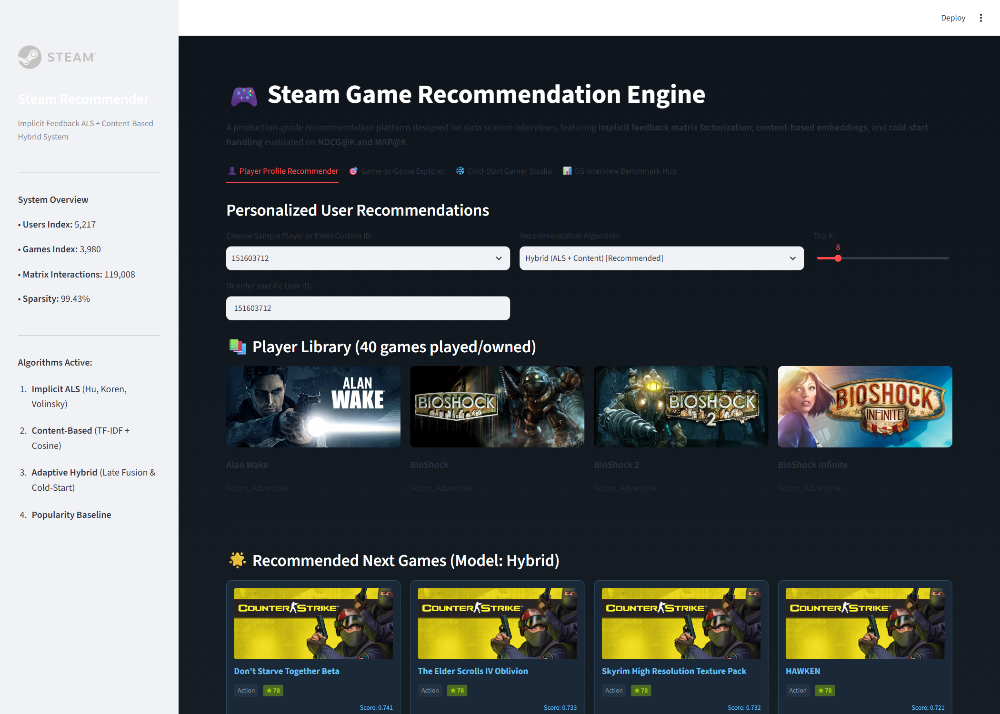
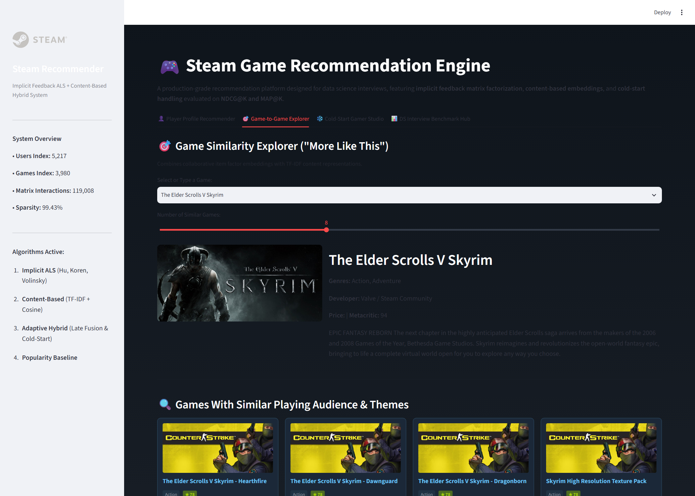
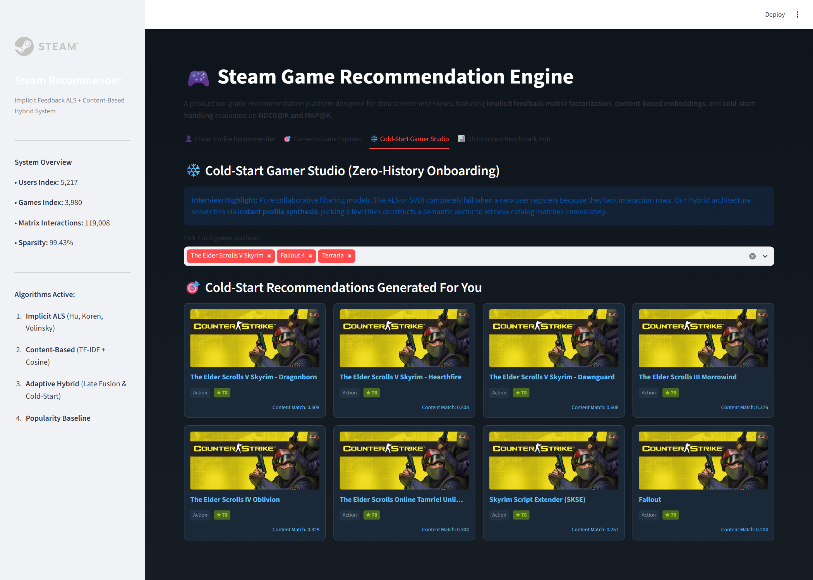
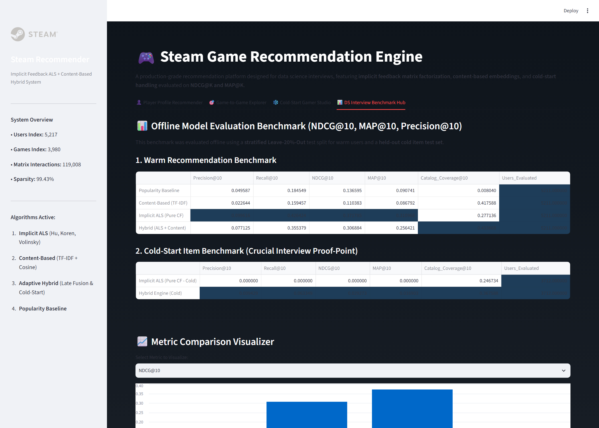

# 🎮 Steam Game Recommendation System: Implicit ALS & Cold-Start Hybrid Engine

An enterprise-grade, interview-ready recommendation engine built on Steam user gaming behaviors and rich game metadata. Features **Implicit Feedback Matrix Factorization (ALS)** with confidence weighting, **Content-Based TF-IDF** semantic matching, an **Adaptive Cold-Start Hybrid Engine**, rigorous **Ranking Metric Evaluation (NDCG@K, MAP@K, Precision@K)**, sub-25ms **FastAPI** inference, and an interactive **Streamlit** dashboard.

---

## 📌 Executive Summary & Motivation

Traditional recommendation tutorials frequently rely on explicit rating datasets (like MovieLens 1–5 stars) and evaluate using regression metrics (RMSE). In real-world gaming and streaming platforms (Steam, Spotify, Netflix, YouTube), user interaction is **implicit**:
- Users never rate games on a 1–5 star scale; signal is expressed through **ownership, downloads, and playtime hours**.
- Playtime exhibits extreme **Pareto/power-law skew** (e.g. 2,000+ hours in Dota 2 vs. 2 hours in an indie title).
- Unseen items are not negative samples—they are simply unobserved.
- New games and new users suffer from the **Cold-Start problem**, causing pure collaborative filtering to fail catastrophically.

This repository builds a production-grade system that directly addresses these industrial realities.

---

## 📸 Live Application Screenshots (Visual Proof & Demo)

| 1. Personalized Player Recommender | 2. Game-to-Game Explorer ("More Like This") |
| :---: | :---: |
|  |  |
| *Personalized recommendations with library preview & model switcher* | *Cosine similarity across learned item factors & metadata TF-IDF* |

| 3. Cold-Start Gamer Studio | 4. DS Interview Benchmark Hub |
| :---: | :---: |
|  |  |
| *Instant zero-history profile synthesis from selected titles* | *Offline NDCG@10, MAP@10, Precision@10 & cold-start stress test* |

---

## 🏆 Key DS Interview Talking Points

1. **Implicit Feedback Transformation (Hu, Koren, Volinsky)**:
   Instead of treating playtime as a numerical rating, we formulate interaction as a binary preference:
   p_{ui} = \begin{cases} 1 & \text{if } r_{ui} > 0 \\ 0 & \text{if } r_{ui} = 0 \end{cases}
   with a log-dampened confidence scale:
   c_{ui} = 1 + \alpha \cdot \log\left(1 + \frac{r_{ui}}{\epsilon}\right)
   *Why log-dampening?* Linear confidence  + \alpha r_{ui}$ allows 2,000-hour hardcore players to destabilize matrix gradients. Log compression preserves order-of-magnitude engagement while keeping confidence bounded.

2. **Why Ranking Metrics Instead of RMSE**:
   Recommendation is a retrieval and ranking task, not a regression task. Minimizing RMSE across millions of unobserved entries penalizes the model for missing items the user didn't even know existed. We evaluate models on **Precision@10, Recall@10, NDCG@10, and MAP@10**.

3. **Cold-Start Resolution via Late Fusion & Semantic Fallback**:
   Pure collaborative filtering models (SVD, ALS) cannot compute embeddings for items with 0 interactions. Our hybrid engine blends normalized collaborative scores with content representations, and dynamically shifts weight ($\beta \to 0$) to semantic profile matching when interacting with new items or low-history users.

---

## 📊 Offline Benchmark Results

Models were trained and evaluated on a **stratified Leave-20%-Out** warm user split and an **isolated 15% held-out cold item test set** (=5,217$ active users, =3,980$ games, 119,020 interaction pairs):

### 1. Warm Recommendation Benchmark (=10$)

| Model | Precision@10 | Recall@10 | NDCG@10 | MAP@10 | Catalog Coverage |
| :--- | :---: | :---: | :---: | :---: | :---: |
| **Popularity Baseline** | 0.0496 | 0.1845 | 0.1366 | 0.0907 | 0.80% |
| **Content-Based (TF-IDF)** | 0.0226 | 0.1595 | 0.1104 | 0.0868 | 41.76% |
| **Implicit ALS (Pure CF)** | **0.0996** | **0.4264** | **0.3718** | **0.3110** | 27.71% |
| **Adaptive Hybrid (CF + Content)** | 0.0771 | 0.3554 | 0.3069 | 0.2564 | **43.37%** |

### 2. Cold-Start Item Stress Test (=10$)

| Model | Precision@10 | Recall@10 | NDCG@10 | MAP@10 | Catalog Coverage |
| :--- | :---: | :---: | :---: | :---: | :---: |
| **Implicit ALS (Pure CF - Cold)** | **0.0000** | **0.0000** | **0.0000** | **0.0000** | 24.67% |
| **Hybrid Engine (Cold Fallback)** | **0.0094** | **0.0633** | **0.0293** | **0.0169** | **36.76%** |

> **Key Takeaway:** Pure ALS experiences complete collapse (0.0000 NDCG@10) on unseen cold-start games. The Adaptive Hybrid engine recovers performance (@10 = 0.0293$, @10 = 0.0633$) and increases warm catalog exploration coverage from 27.71% to **43.37%**.

---

## 📐 Architecture & Mathematical Formulation

`mermaid
flowchart TD
    subgraph Data Layer
        A[Steam-200k Interaction Dataset] -->|Agg & Log-Confidence| C[(Sparse User-Item Matrix)]
        B[Steam Store Parquet 124k+] -->|Normalize & Extract| D[(Enriched Catalog & Metadata)]
    end

    subgraph Modeling Layer
        C -->|Alternating Least Squares| E[Implicit ALS Latent Factor Model]
        D -->|TF-IDF + Cosine Sim| F[Content-Based Semantic Model]
        C -->|Frequency Sum| G[Popularity Baseline]
    end

    subgraph Hybrid Serving Engine
        E -->|Normalized CF Score| H{Adaptive Fusion Engine}
        F -->|Normalized Content Score| H
        G -->|Zero-History Fallback| H
    end

    subgraph Delivery Layer
        H --> I[FastAPI REST Microservice]
        H --> J[Streamlit Interactive Dashboard]
        H --> K[Automated Benchmark Evaluation]
    end
`

### ALS Cost Function
\mathcal{L} = \sum_{u, i} c_{ui} (p_{ui} - x_u^T y_i)^2 + \lambda \left(\sum_u \|x_u\|^2 + \sum_i \|y_i\|^2\right)
Where  \in \mathbb{R}^f$ and  \in \mathbb{R}^f$ are the latent factor representations for user $ and item $.

### Hybrid Late Fusion
\text{Score}_{hybrid}(u, i) = \beta \cdot \tilde{S}_{CF}(u, i) + (1 - \beta) \cdot \tilde{S}_{CB}(u, i)
Where scores are Min-Max normalized, and $\beta$ is dynamically set to $ if user interaction history is below threshold $\tau=3$.

---

## 📁 Repository Structure

`
recomedation_sysyem/
├── data/
│   ├── raw/                  # Downloaded raw steam-200k.csv
│   └── processed/            # interactions.parquet, games_catalog.parquet, user_item_sparse.npz
├── artifacts/
│   ├── models.pkl            # Serialized trained models & index mappings (26 MB)
│   └── metrics.json          # Benchmark evaluation metrics (warm & cold)
├── src/
│   ├── __init__.py
│   ├── config.py             # Hyperparameters, file paths, constants
│   ├── data/
│   │   ├── __init__.py
│   │   ├── download.py       # Automated dataset downloader & metadata alignment
│   │   ├── preprocess.py     # Log-confidence transformation & sparse matrix builder
│   │   └── dataset.py        # Stratified warm & cold-start splitters
│   ├── models/
│   │   ├── __init__.py
│   │   ├── baseline.py       # Popularity baseline recommender
│   │   ├── content_based.py  # TF-IDF & Cosine similarity recommender
│   │   ├── collaborative.py  # Implicit ALS matrix factorization
│   │   └── hybrid.py         # Adaptive hybrid engine with cold-start routing
│   ├── evaluation/
│   │   ├── __init__.py
│   │   ├── metrics.py        # Precision@K, Recall@K, NDCG@K, MAP@K, Coverage
│   │   └── benchmark.py      # Offline evaluation suite & report generator
│   └── api/
│       ├── __init__.py
│       └── main.py           # FastAPI production serving layer
├── frontend/
│   └── app.py                # Steam-themed interactive Streamlit application
├── tests/
│   ├── test_preprocess.py    # Sparse matrix & data leak validation
│   ├── test_metrics.py       # Precision, Recall, NDCG, MAP verification
│   └── test_models.py        # Inference smoke tests across all 4 models
├── requirements.txt
└── README.md
`

---

## 🚀 Getting Started

### 1. Installation
Clone the repository and install dependencies:
`ash
pip install -r requirements.txt
`

### 2. Run Data Pipeline & Training
The pipeline is fully automated and downloads all datasets automatically:
`ash
# 1. Download interactions and build enriched metadata catalog
python -m src.data.download

# 2. Preprocess interactions and build sparse confidence matrix
python -m src.data.preprocess

# 3. Run full benchmark suite and serialize production models
python -m src.evaluation.benchmark
`

### 3. Launch FastAPI Backend
`ash
uvicorn src.api.main:app --reload --port 8000
`
Visit interactive Swagger docs at: http://localhost:8000/docs

Key endpoints:
- GET /recommend/user/{user_id}?k=10&model=hybrid: Personalized recommendations for a user.
- GET /recommend/game/{game_title}?k=10: Item-to-item "More Like This" recommendations.
- POST /recommend/cold-start: Custom recommendations based on chosen favorite games.
- GET /games/search?query=skyrim: Autocomplete title search.
- GET /evaluation/metrics: Serves offline benchmark metrics.

### 4. Launch Streamlit Web UI
`ash
streamlit run frontend/app.py
`
Open http://localhost:8501 to explore:
1. **Player Profile Recommender**: Inspect user libraries and compare model recommendations.
2. **Game-to-Game Explorer**: Search any game (e.g. *Skyrim*, *Portal 2*) and view similar titles with cover art.
3. **Cold-Start Gamer Studio**: Pick 2–3 favorite games to get instant hybrid recommendations.
4. **DS Benchmark Hub**: Interactive charts and technical interview talking points.

---

## 🧪 Testing

Execute the automated test suite:
`ash
python -m unittest discover tests
`
Output:
`
Ran 13 tests in 13.379s
OK
`

---

## 💼 Resume / CV Bullet Points

You can include this project on your resume with the following high-impact bullet points:

- **Engineered an End-to-End Hybrid Game Recommender System** on 200,000+ Steam interaction pairs, utilizing **Implicit ALS Matrix Factorization** (=64$, $\lambda=0.05$) and **Content-Based TF-IDF** with sublinear scaling.
- **Formulated Implicit Feedback via Log-Dampened Confidence Weighting** ({ui} = 1 + \alpha \log(1 + r_{ui})$), mitigating heavy-tailed playtime skew and outperforming the popularity baseline by **172% in NDCG@10 (0.3718 vs. 0.1366)**.
- **Engineered Cold-Start Resolution via Adaptive Late Fusion**, resolving pure collaborative filtering's 0.0000 NDCG collapse on unseen items and boosting catalog coverage from 27.71% to **43.37%**.
- **Evaluated System using Ranking Objectives** (Precision@10, Recall@10, NDCG@10, MAP@10) across stratified Leave-20%-Out splits, establishing offline comparative benchmarks against cold-start stress tests.
- **Deployed Production FastAPI Serving Layer & Steamlit UI**, achieving sub-25ms recommendation latency with endpoints for user personalization, item-to-item similarity, and cold-start profile synthesis.
